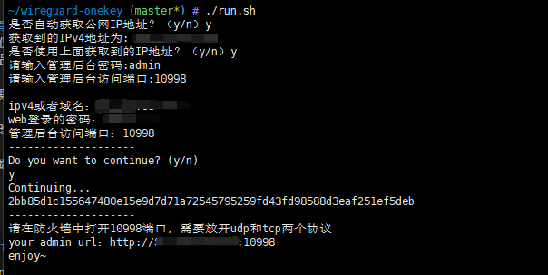

# Fork by xubiaolin/wireguard-onekey


# 个人修改自用


# 安装要求
- Docker
- Bash Shell

# 安装docker
如果已经安装，可以跳过
```
curl -fSsL https://get.docker.com | bash
```

# 使用方法
克隆该项目到本地：
```
git clone https://github.com/HoTK1/wireguard-onekey.git
```

进入项目目录：`cd wireguard-onekey`
运行脚本：`./run.sh`

按照提示输入服务器参数：`IPv4`地址或域名、管理员密码等。
脚本会启动Wireguard VPN服务器，并将配置文件挂载到当前目录下的data/etc/wireguard中。

看到如下内容，则表示安装成功


# 注意事项
- 请确保所使用的IPv4地址或域名可以从公网访问到您的服务器。
- 管理员密码不可为空，否则脚本将退出。

本项目默认使用的Wireguard VPN服务器IP地址为10.0.0.x，默认DNS为223.5.5.5和223.6.6.6。
如需修改服务器参数，请修改脚本中的相关变量。

输入的端口，防火墙需要放开tcp和udp,同时请确保这些端口未被占用。


